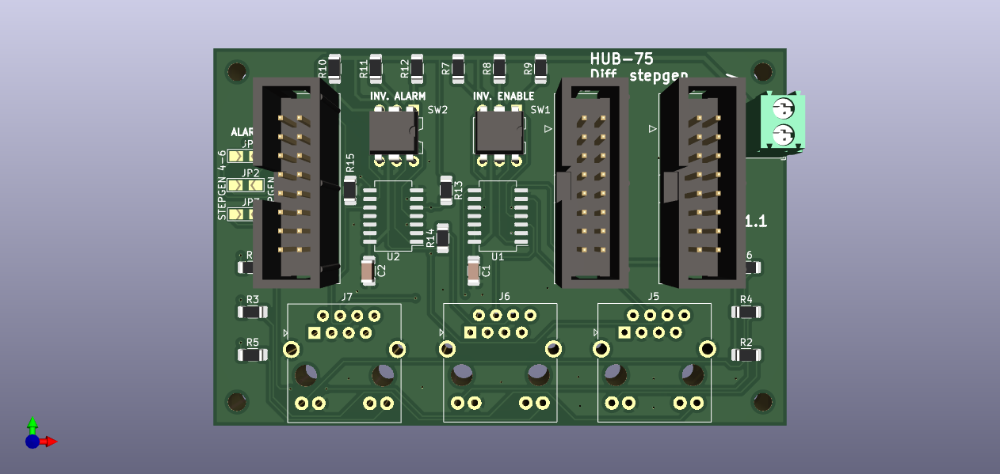
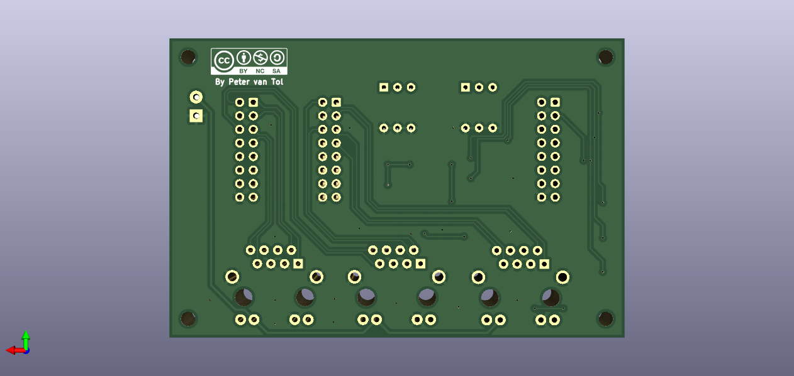

# HUB-75 Differential stepgen
Break-out board with 3 stepgen channels. As most stepper motor drivers are opto-isolated, the board does not provide any extra isolation.





> **NOTE** <br> On the images the RJ45-connectors and the SO-16 packages are not displayed as their models are not available in KiCAD.

## Features

- 2 HUB-75 input connectors
- 1 HUB-75 output connector for alarm
- 3 channel differential stepgen drivers using RJ-45 plugs with frequency up to 400 kHz
- status LEDs on RJ-45 plugs for Enable and Alarm
- selectable active HIGH or active LOW for Enable using dip-switches
- selectable active HIGH or active LOW for Alarm using dip-switches

Two differential stepgen BOBs can share HUB-75 output connector by setting the solder jumpers on the board for either stepgen 1-3 or stepgen 4-6.

## Applications

- Driving stepper motor drivers with internal opto-couplers.

> **NOTE** <br> To save on the number of outputs used, one can opt for a single ended version of the BOB.

## Example wiring

Any standard UTP-cable can be used for as a 'donor' for connecting the BOB to the driver. One can either:
- cut the cable and use the wires in the screw-terminals of the driver.
- create a small break-out board with RJ45 connector which fits your driver. The pitch *and* the order of the pins makes this a custom solution for almost any driver. These break-out boards, when developed, will be shared here as well, listed by type of the driver. These will be designed to be DIY, as small PCB's tend to be expensive.


The pin-out of the cable is as folllows

| RJ-45 pin | Color        | Function | 
|-----------|--------------|----------|
| 1         | green/white  | STEP-    |
| 2         | green        | STEP+    |
| 3         | orange/white | GND      |
| 4         | blue         | ENA      |
| 5         | blue/white   | GND      |
| 6         | orange       | ALARM    |
| 7         | brown/white  | DIR-     |
| 8         | brown        | DIR+     |

## Litex-CNC example configuration
Let's assume that the two output HUB-745 connectors on this board are connected to J1 and J2 of the FPGA and the input connector is J16. To configure the pins for output, you can use the configuration-block below as a starting point. Optionaly the pin names can also be set in the configuration, making the HAL clearer.

``` json
{
    ...,
    "stepgen": [
        {
            "step_pin": "j1:0",
            "dir_pin": "j1:1",
            "soft_stop": true
        },
        {
            "step_pin": "j1:2",
            "dir_pin": "j1:4",
            "soft_stop": true
        }
        {
            "step_pin": "j1:5",
            "dir_pin": "j1:6",
            "soft_stop": true
        },
        {
            "step_pin": "j2:0",
            "dir_pin": "j2:1",
            "soft_stop": true
        },
        {
            "step_pin": "j2:2",
            "dir_pin": "j2:4",
            "soft_stop": true
        }
        {
            "step_pin": "j2:5",
            "dir_pin": "j2:6",
            "soft_stop": true
        }
    ],
    "gpio_in": [
        {"pin": "j16:0", "name": "stepgen.0.alarm"},
        {"pin": "j16:1", "name": "stepgen.1.alarm"},
        {"pin": "j16:2", "name": "stepgen.2.alarm"},
        {"pin": "j16:4", "name": "stepgen.3.alarm"},
        {"pin": "j16:5", "name": "stepgen.4.alarm"},
        {"pin": "j16:6", "name": "stepgen.5.alarm"},
    ],
    "gpio_in": [
        {"pin": "j1:14", "name": "stepgen.enable"},
    ],
    ...
}
```

> **NOTE** <br> The BOB uses pin 14 (`OE`) of the HUB-75 connector, which is a shared pin. This board therefore cannot be used in combination with other BOB's using the same pin when it's function is incompatible.

## Bill of materials
The table below gives the bill of materials used for this BOB and an indication of its price. The list is available as public list for the following companies:
* [Reichtelt](https://www.reichelt.de/my/1997667). This is non-affiliate link, I do not earn any money when you order this list from this specific vendor, nor the vendor endorses this project. Reichtelt is a supplyer for Western Europe.

When you order with Mouser or antohter supplier, please share a list here.


| Part. number | Package   | Description                        | Datasheet | Amount | Price*  |
|--------------|-----------|------------------------------------|-----------|--------|---------|
| 74HC85       | SO-16     | Quad XOR-gates                     |           | 2      | € 0.26  |
| 270          | SMD 1206  | Resistor, 270 Ohm                  |           | 6      | € 0.03  |
| 10K          | SMD 1206  | Resistor, 10 kOhm                  |           | 12     | € 0.03  |
| DIP 3P       | DIP-6     | DIP-switch, 3P                     |           | 2      | € 0.33  |
| DG250 3,5-2  | -         | Screw/spring terminal 2.5 mm pitch |           | 1      | € 0.22  |
| BOX 2X8      | -         | Box header 2x8, 2.54 mm pitch      |           | 3      | € 0.16  |
| CAT5         | -         | RJ-45 Bus with LED**               |           | 3      | € 1.07  |

**NOTES**: 
1. The price is based on availability in the Netherlands with a single shop for all parts. Parts might be sourced cheaper depending on your location, available sources and the time you want to wait before receiving the components.
2. When using a different source for the connector, please verify the footprint, as there are many variants.

## Known issues

This board does not have any known issues yet.

If you find any issue, please file a bug using GitHub.
