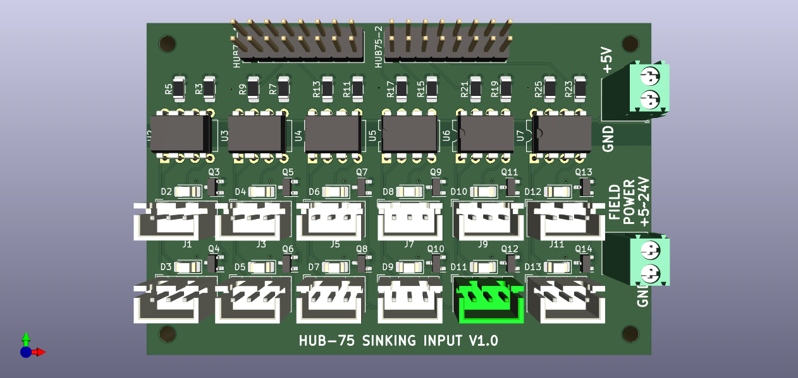
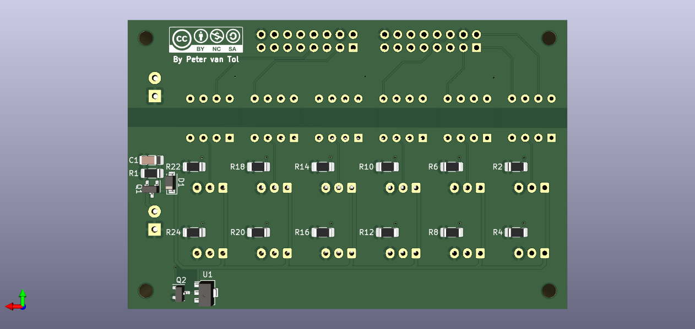

# HUB-75 Sinking input 
Break-out board with 12 channel sinking input. The FPGA is galvanically separated from field power using opto-couplers.





## Features

- 2 HUB-75 output connectors
- 12 channel sinking output using JST connectors
- 5\~24 V Field power with reverse polarity protection
- indicating LED for each output
- indicated switching frequency 1 kHz

## Applications

- PNP (souring) limit switches
- Momentary push-buttons
- Slow encoders, for example for user input

> **NOTE** <br> The `PC827` optocouplers have a maximum rated frequency of 80 kHz. It is recommended to start at a frequency of 1 kHz and work up from there.

## Example wiring

TODO: example

## Litex-CNC example configuration
Let's assume that the two HUB-745 connectors on this board are connected to J15 and J16 of the FPGA. To configure the pins for output, you can use the configuration-block below as a starting point. Optionaly the pin names can also be set in the configuration, making the HAL clearer.

``` json
{
    ...,
    "gpio_in": [
        {"pin": "j15:0"},
        {"pin": "j15:1"},
        {"pin": "j15:2"},
        {"pin": "j15:4"},
        {"pin": "j15:5"},
        {"pin": "j15:6"},
        {"pin": "j16:0"},
        {"pin": "j16:1"},
        {"pin": "j16:2"},
        {"pin": "j16:4"},
        {"pin": "j16:5"},
        {"pin": "j16:6"}
    ],
    ...
}
```

Alternatively, the BOB can also be used for PWM output. In that case the configuration may look something like below. In this example it is assumed that outputs on J16 are used for three encoders.

``` json
{
    ...,
    "encoders": [
        {  
            "pin_A":"j16:0",
            "pin_B":"j16:1"
        },
        {  
            "pin_A":"j16:2",
            "pin_B":"j16:4"
        },
        {  
            "pin_A":"j16:5",
            "pin_B":"j16:6"
        }
    ],
    ...
}
```

## Bill of materials

The table below gives the bill of materials used for this BOB and an indication of its price. The list is available as public list for the following companies:
* [Reichtelt](https://www.reichelt.de/my/1998173). This is non-affiliate link, I do not earn any money when you order this list from this specific vendor, nor the vendor endorses this project. Reichtelt is a supplyer for Western Europe.

When you order with Mouser or antohter supplier, please share a list here.

| Part. number | Package   | Description                        | Datasheet | Amount | Price*  |
|--------------|-----------|------------------------------------|-----------|--------|---------|
| LTV827       | DIP-8     | Dual-channel opto-coupler          |           | 6      | € 0.31  |
| AO3401A      | SOT-23    | P-Channel MOSFET, 30V              |           | 1      | € 0.25  |
| ZENER 12V    | SOT-23    | 12V Zener diode***                 |           | 1      | € 0.05  |
| 4.7K         | SMD 1206  | Resistor, 4.7 kOhm                 |           | 12     | € 0.03  |
| 10K          | SMD 1206  | Resistor, 10 kOhm                  |           | 1      | € 0.03  |
| LED          | SMD 1206  | LED, green, If > 20 mA             |           | 12     | € 0.08  |
| CAP 15N      | SMD 1206  | Capitor, 15 nF                     |           | 1      | € 0.02  |
| JST XH 3P    | -         | JST XH conn. 2.5 mm pitch          |           | 12     | € 0.15  |
| DG250 3,5-2  | -         | Screw/spring terminal 2.5 mm pitch |           | 2      | € 0.22  |
| BOX 2X8      | -         | Box header 2x8, 2.54 mm pitch      |           | 2      | € 0.16  |
| 2N7002**     | SOT-23    | N-Channel MOSFET (current mirror)  |           | 13     | € 0.04  |
| CL2N8-G**    | SOT-89    | LED-driver 20 mA (current mirror)  |           | 1      | € 0.39  |
| R**          | SMD 1206  | Resistor, TBD Ohm (alternative)    |           | 12     | € 0.03  |

**NOTES**: 
1. The price is based on availability in the Netherlands with a single shop for all parts. Parts might be sourced cheaper depending on your location, available sources and the time you want to wait before receiving the components.
2. The components `CL2N8-G` and `2N7002` form a current mirror for driving the status LEDs. This current mirror can be replaced with a fixed resistor `R`, which should be calculated based on the voltage used for Field power.
3. The zener diode is only required when Field Power is >12 Volt for protecting the MOSFETs.

## Known issues

This board does not have any known issues yet.

If you find any issue, please file a bug using GitHub.
