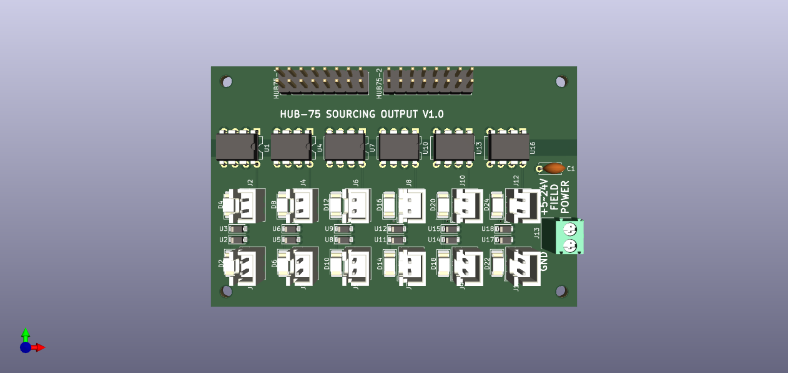
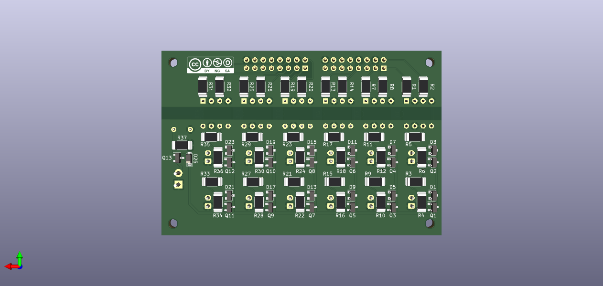

# HUB-75 Sourcing output 
Break-out board with 12 channel sourcing output. The FPGA is galvanically separated from field power using opto-couplers. To enhance the power each channel can deliver, the loads are being switched with a MOSfet (`AO3401A`). 





## Features

- 2 HUB-75 input connectors
- 12 channel sourcing output using JST connectors
- 5\~24 V Field power with reverse polarity protection
- rated 300 mA power per channel
- indicating LED for each output
- indicated switching frequency 1 kHz

## Applications

- Driving LEDs (optional dimmable by using PWM)
- Driving solenoids with current lower then rated current
- Driving relays for larger loads 

> **NOTE** <br> The `PC827` optocouplers have a maximum rated frequency of 80 kHz. When using this board in combination with PWM, the chosen frequency should be well below this limit. It is recommended to start at a frequency of 1 kHz and work up from there. PDM with LitexCNC will not work with this board, because the frequency cannot be set and will be too high. 

## Example wiring

TODO: example

> **NOTE** <br> When connecting any inductive loads, please connect a fly-back diode!

## Litex-CNC example configuration
Let's assume that the two HUB-745 connectors on this board are connected to J1 and J2 of the FPGA. To configure the pins for output, you can use the configuration-block below as a starting point. Optionaly the pin names can also be set in the configuration, making the HAL clearer.

``` json
{
    ...,
    "gpio_out": [
        {"pin": "j1:0"},
        {"pin": "j1:1"},
        {"pin": "j1:2"},
        {"pin": "j1:4"},
        {"pin": "j1:5"},
        {"pin": "j1:6"},
        {"pin": "j2:0"},
        {"pin": "j2:1"},
        {"pin": "j2:2"},
        {"pin": "j2:4"},
        {"pin": "j2:5"},
        {"pin": "j2:6"}
    ],
    ...
}
```

Alternatively, the BOB can also be used for PWM output. In that case the configuration may look something like below. In this example it is assumed that outputs J10 through J12 on the BOB are used for PWM.

``` json
{
    ...,
    "gpio_out": [
        {"pin": "j1:0"},
        {"pin": "j1:1"},
        {"pin": "j1:2"},
        {"pin": "j1:4"},
        {"pin": "j1:5"},
        {"pin": "j1:6"},
        {"pin": "j2:0"},
        {"pin": "j2:1"},
        {"pin": "j2:2"}
    ],
    "pwm": [
        {"pin": "j2:4"},
        {"pin": "j2:5"},
        {"pin": "j2:6"}
    ]
    ...
}
```

When using PWM, the HAL pin `pwm.###.pwm_freq` should be set to a value smaller then 1000 (1 kHz). Higher frequencies can be tested using the board, by increasing this value. The uppper limit is 80 kHz, which is the maximum frequency of the `PC817` opto-coupler. 

## Bill of materials

The table below gives the bill of materials used for this BOB and an indication of its price. The list is available as public list for the following companies:
* [Reichtelt](https://www.reichelt.de/my/1997628). This is non-affiliate link, I do not earn any money when you order this list from this specific vendor, nor the vendor endorses this project. Reichtelt is a supplyer for Western Europe.

When you order with Mouser or antohter supplier, please share a list here.

| Part. number | Package   | Description                        | Datasheet | Amount | Price*  |
|--------------|-----------|------------------------------------|-----------|--------|---------|
| LTV827       | DIP-8     | Dual-channel opto-coupler          |           | 6      | € 0.31  |
| AO3401A      | SOT-23    | P-Channel MOSFET, 30V              |           | 13     | € 0.25  |
| ZENER 12V    | SOT-23    | 12V Zener diode***                 |           | 13     | € 0.05  |
| 200R         | SMD 1206  | Resistor, 200 Ohm                  |           | 12     | € 0.03  |
| 240          | SMD 1206  | Resistor, 240 Ohm                  |           | 12     | € 0.03  |
| 10K          | SMD 1206  | Resistor, 10 kOhm                  |           | 13     | € 0.03  |
| LED          | SMD 1206  | LED, green, If > 20 mA             |           | 12     | € 0.08  |
| CAP 15N      | SMD 1206  | Capitor, 15 nF                     |           | 1      | € 0.02  |
| JST XH 2P    | -         | JST XH conn. 2.5 mm pitch          |           | 12     | € 0.15  |
| DG250 3,5-2  | -         | Screw/spring terminal 2.5 mm pitch |           | 1      | € 0.22  |
| BOX 2X8      | -         | Box header 2x8, 2.54 mm pitch      |           | 2      | € 0.16  |
| 2N7002**     | SOT-23    | N-Channel MOSFET (current mirror)  |           | 13     | € 0.04  |
| CL2N8-G**    | SOT-89    | LED-driver 20 mA (current mirror)  |           | 1      | € 0.39  |
| R**          | SMD 1206  | Resistor, TBD Ohm (alternative)    |           | 12     | € 0.03  |

**NOTES**: 
1. The price is based on availability in the Netherlands with a single shop for all parts. Parts might be sourced cheaper depending on your location, available sources and the time you want to wait before receiving the components.
2. The components `CL2N8-G` and `2N7002` form a current mirror for driving the status LEDs. This current mirror can be replaced with a fixed resistor `R`, which should be calculated based on the voltage used for Field power.
3. The zener diode is only required when Field Power is >12 Volt for protecting the MOSFETs.

## Known issues

- The reverse voltage protection uses a footprint for the resistor which is too large in the prototype (component not available). In the next version this footprint is modified to the default SMD 1206. Also the cpacitor is a through-hole component, as the value was wrong. The value is corrected in the BOM. In the next version this component is also replaced to SMD 1206.
- Current mirror is to be tested whether it works reliable.

If you find more issues, please file a bug using GitHub.

# Version history

**1.1**
* Corrected P-channel MOSFET's, the source and drain where switched, which prevented the V1.0 board from working. 
* Changed pin-headers to IDC-headers. Rerouted because of more space required by the IDC-header
* Corrected footprint of reverse current protection. Added jumper to be able to by-pass this circuit. 

**1.0**
* Initial version for proto-type.
