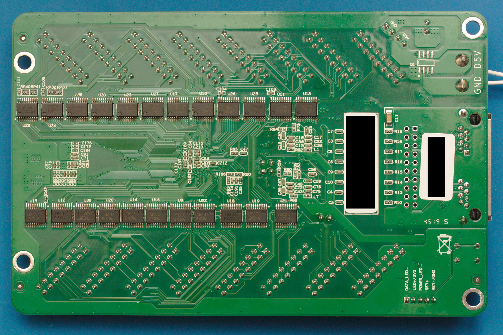

# HUB-75 boards

The HUB-75 boards is a collection of break-out boards (BOBs) for HUB-75 connnectors found on re-purposed FPGA cards such as the 5A-75B and 5A-75E. These cards can be picked up for 10\~20 dollars from China and form an ideal basis for tinkering with FPGAs. Based on these cheap FPGA's a project has been spraked, called Litex-CNC, which aims to repurpose these cards to a cheap CNC controller. CNC-machines normally have field power which is 12\~24V and thus the FPGA cannot direclty be connected to the components of the machine. Therefore a set of break-out boards have been developed for GPIO inputs/outputs, stepgen, encoders, etc.

## Design philosophy
> Why not a hat one might ask? This project offers more flexibility. By combining different break-out can be combined to suit the machine that is being built. A hat also comes with a larger risk in design errors; smaller boards are easier to design, produce and check.

All BOBs will have the same dimensions of 85 mm x 56 mm. This size is equal to that of the Raspberry Pi 4, however the mounting holes are placed on the four corners and thus different from the RPi. Getting the mounting holes at the same location as the RPi made the design much more difficult. Placement of the connectors also hampers stacking these boards on top of each other, so not being to able to stack them on top of a RPi seems permissible.

The outputs of the BOBs will be on the bottom edge (long side). Field power and logic power are provided from the left side of the board. The HUB-75 connectors will be placed on the top of the boards. This makes it easier to route the digital signals and high-power signals separately from each other in the cabinet.

The smalles trace and spacing is 0.2 mm. These boards are designed to be ordered from an online PCB manufacturer. Some desktop milling machines might have the accuracy to create these traces, so you might give it a try when you are feeling lucky. The smallest holes (vias) are 0.3 mm in size.

All components are selected to be hand-solderable. This means that the following minimum sizes SMD components will be used:
- resistors, LED's, capacitors: 2010
- diodes: SOD-123
- FET, transistors: SOT-23

## HUB-75 pinout
Each connector has 6 individual pins (1, 2, 3, 5, 6, and 7) and 8 shared pins (8 through 15). The standard pin-out of a HUB-75 connector is shown below.

| HUB75 pin | Pin   | Pin   | HUB75 pin |
|-----------|-------|-------|-----------|
| R0        | 1     | 2     | G0        |
| B0        | 3     | 4     | *GND*     |
| R1        | 5     | 6     | G1        |
| B1        | 7     | 8     | E         |
| A         | 9     | 10    | B         |
| C         | 11    | 12    | D         |
| CLK       | 13    | 14    | STB       |
| OE        | 15    | 16    | *GND*     |

Each HUB-75 connector will use the individual pins and in special cases one of the shared pins. In the design it should be tkaen into account that boards which uses the same shared pins might be mutual exclusive when the functions are different (different types of stepgen BOBs can off course be combined.

## Available BOBs
The table below shows the BOBs which are currently available in this repository. 

TODO: work-in-pogress

## Connecting the BOBs to your FPGA
On both the 5A-75B and the 5A-75E the `74HC245T` buffers are hard-wired as outputs. To be able to use the HUB-75 boards which require an input (as seen from the FPGA) some modifications on the board are required. Of both boards different versiosn exist, so the components can be at a different location on your board. Below are the locations of the buffer on a 5A-75B V6.1 (front) and 5A-75E V6.0 (back).

Each buffer has 8 channels, while every HUB-75 connector has 6 individual pins. When you replace a buffer you will cahnge the behavior of one HUB-75 connector and partly that of its neighbor. All HUB-75 boards assume that a connector is either fully configured as input or as output. Therefore it is recommended to change the buffers direclty adjacent to each other, so the minimum amount of available connectors (partly input/ouput) are wasted.

The following changes have to be made to the buffers:
* De-solder the `74HC245T` buffer, this buffer cannot be re-used because its pins are not 5 Volt tolerant when `Vcc` is 3.3 Volt.
* Cut the trace to the pin `Vcc` (pin 20) and wire it to a 3.3V source (for example the JTAG-header). If you don't do this, a buffer configure as input will put 5 Volts on the pins of the FPGA, which will definately fry that pin or the whole board.
* Cut the trace to the pin `DIR` (pin 20) and wire it to a GND source to configure the buffer as input.
* Replace the buffer with a buffer with 5V tolerant inputs, such as the `74LVC245`.

After these modifications the board might look a like this (on this particular board a single buffer has been replace, as it is a test-board for LitexCNC).

TODO: picture to be taken

## License 
The boards in this repository are licensed unde Creative Commons BY-NC-SA. This means you are allowed to:
* **Share** — copy and redistribute the material in any medium or format
* **Adapt** — remix, transform, and build upon the material

As long as:
* **Attribution** — You must give appropriate credit, provide a link to the license, and indicate if changes were made. You may do so in any reasonable manner, but not in any way that suggests the licensor endorses you or your use.
* **NonCommercial** — You may not use the material for  commercial purposes. Of course you can use the machine you created or modified using these boards for commercial purposes. 
* **ShareAlike** — If you remix, transform, or build upon the material, you must distribute your contributions under the  same license  as the original.
